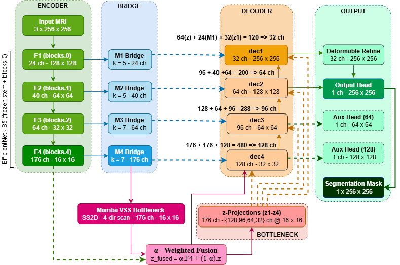
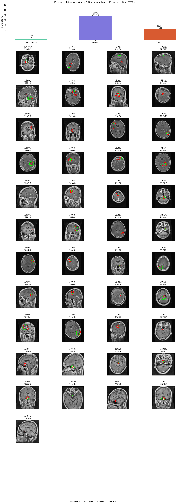

# Integrating State Space Models and Attention Mechanisms for Brain Tumor Segmentation in MRI

<p align="center">


</p>

Official PyTorch implementation accompanying our Springer Nature manuscript:

> **Integrating State Space Models and Attention Mechanisms for Brain Tumor Segmentation in MRI**

---

## Overview

MMAUNet is a hybrid encoder-decoder architecture designed for automatic brain tumor segmentation from contrast-enhanced MRI.

The proposed architecture integrates

- EfficientNet-B5 Encoder
- MedNeXt Bridge Blocks
- Mamba State Space Bottleneck
- CBAM Decoder
- Deformable Refinement

to capture both local spatial information and long-range contextual dependencies.

---

# Architecture

<p align="center">



</p>

---

# Key Features

✅ Hybrid CNN + State Space architecture

✅ MedNeXt bridge for feature refinement

✅ Mamba bottleneck for long-range modeling

✅ CBAM attention decoder

✅ Deformable boundary refinement

✅ GradCAM visualization

✅ Failure case analysis

---

# Repository Structure

```text
MMAUNet
│
├── configs/
├── datasets/
├── docs/
├── losses/
├── models/
├── outputs/
├── pretrained/
├── scripts/
├── utils/
│
├── README.md
├── requirements.txt
└── LICENSE
```

---

# Installation

Clone repository

```bash
git clone https://github.com/Abhi-Chevuri/MMA-UNet.git

cd MMA-UNet
```

Install dependencies

```bash
pip install -r requirements.txt
```

---

# Dataset

Experiments were performed using the public FigShare Brain Tumor MRI dataset.

Please organize the dataset as

```text
dataset/

├── images/

└── masks/
```

---

# Training

```bash
python scripts/train.py
```

---

# Testing

```bash
python scripts/test.py
```

---

# Prediction

```bash
python scripts/predict.py
```

---

# Results

| Metric | Score |
|---------|------:|
| Dice | 0.9063 |
| IoU | 0.8304 |
| Precision | 0.9043 |
| Recall | 0.9092 |
| Specificity | 0.9982 |

## Results


---

## GradCAM


---

## Failure Analysis


---

# Repository Contents

| Folder | Description |
|----------|------------|
| configs | Configuration files |
| datasets | Dataset loader |
| docs | Figures used in README |
| losses | Loss functions |
| models | MMAUNet implementation |
| outputs | Generated predictions, GradCAM and Failure cases |
| pretrained | Loaded checkpoint of best model |
| scripts | Train, test and inference scripts |
| utils | Metrics, visualization and utilities |

---

# Reproducibility

All experiments reported in the manuscript use

- identical train/validation/test split
- fixed random seed
- identical preprocessing
- identical evaluation protocol

to ensure reproducibility.

---

# Citation

If you find this repository useful, please cite

```bibtex
@article{MMAUNet2026,
    title={Integrating State Space Models and Attention Mechanisms for Brain Tumor Segmentation in MRI},
    author={},
    journal={Springer Nature},
    year={2026}
}
```

(Will be updated after publication.)

---

# License

This project is released under the MIT License.

---


⭐ If you find this repository useful, consider giving it a star.
